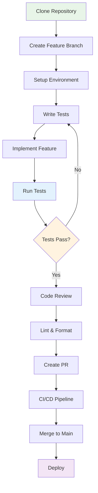

# Desenvolvimento

## 💻 Fluxo de Desenvolvimento

### 🔄 Workflow Recomendado



## 🚀 Configuração do Ambiente

### 1. Preparação Inicial

```bash
# Clone do repositório
git clone https://github.com/pycodebr/car_api.git
cd car_api

# Criar branch para feature
git checkout -b feature/nova-funcionalidade

# Verificar pré-requisitos
python --version  # Python 3.13+
poetry --version  # Poetry instalado
```

### 2. Instalação de Dependências

```bash
# Instalar dependências com Poetry
poetry install

# Verificar ambiente virtual
poetry env info

# Ativar shell (opcional)
poetry shell
```

### 3. Configuração do Banco

```bash
# Copiar arquivo de configuração
cp .env.example .env

# Editar configurações
nano .env

# Executar migrações
poetry run alembic upgrade head

# Verificar conexão
poetry run python -c "from car_api.core.database import engine; print('Database OK')"
```

## 🧪 Test-Driven Development (TDD)

### Ciclo TDD: Red → Green → Refactor

#### 1. 🔴 Red: Escrever Teste que Falha

```python
# tests/test_new_feature.py
import pytest
from httpx import AsyncClient

class TestNewFeature:
    async def test_create_car_with_insurance(self, client: AsyncClient, auth_headers):
        """Teste para nova funcionalidade de seguro."""
        car_data = {
            "model": "Civic",
            "brand_id": 1,
            "insurance": {
                "company": "Porto Seguro",
                "policy_number": "12345",
                "expires_at": "2024-12-31"
            }
        }

        response = await client.post(
            "/api/v1/cars/",
            json=car_data,
            headers=auth_headers
        )

        assert response.status_code == 201
        assert response.json()["insurance"]["company"] == "Porto Seguro"
```

#### 2. 🟢 Green: Implementar Funcionalidade Mínima

```python
# car_api/models/cars.py
class Insurance(Base):
    __tablename__ = 'insurances'

    id: Mapped[int] = mapped_column(primary_key=True)
    company: Mapped[str] = mapped_column(String(100))
    policy_number: Mapped[str] = mapped_column(String(50))
    expires_at: Mapped[date]
    car_id: Mapped[int] = mapped_column(ForeignKey('cars.id'))

class Car(Base):
    # ... campos existentes
    insurance: Mapped[Optional['Insurance']] = relationship(
        'Insurance', back_populates='car'
    )
```

```python
# car_api/schemas/cars.py
class InsuranceSchema(BaseModel):
    company: str = Field(..., min_length=1, max_length=100)
    policy_number: str = Field(..., min_length=1, max_length=50)
    expires_at: date

class CarSchema(BaseModel):
    # ... campos existentes
    insurance: Optional[InsuranceSchema] = None
```

#### 3. 🔵 Refactor: Melhorar Implementação

```python
# car_api/routers/cars.py
@router.post('/', response_model=CarPublicSchema)
async def create_car(
    car: CarSchema,
    current_user: User = Depends(get_current_user),
    db: AsyncSession = Depends(get_session),
):
    # Validações existentes...

    # Criar carro
    db_car = Car(**car.model_dump(exclude={'insurance'}), owner_id=current_user.id)
    db.add(db_car)
    await db.flush()  # Para obter o ID

    # Criar seguro se fornecido
    if car.insurance:
        db_insurance = Insurance(
            **car.insurance.model_dump(),
            car_id=db_car.id
        )
        db.add(db_insurance)

    await db.commit()
    await db.refresh(db_car)

    return db_car
```

### Executar Testes Durante Desenvolvimento

```bash
# Executar testes específicos
poetry run pytest tests/test_new_feature.py -v

# Executar com coverage
poetry run pytest tests/test_new_feature.py --cov=car_api

# Watch mode (reexecutar quando arquivos mudarem)
poetry run ptw --now tests/test_new_feature.py

# Executar apenas testes que falharam
poetry run pytest --lf
```

## 🔧 Ferramentas de Desenvolvimento

### Taskipy - Automação de Tarefas

```toml
# pyproject.toml
[tool.taskipy.tasks]
# Desenvolvimento
dev = 'fastapi dev car_api/app.py --reload'
shell = 'ipython'

# Qualidade de código
lint = 'ruff check'
format = 'ruff format'
type-check = 'mypy car_api'

# Testes
test = 'pytest -v --cov=car_api'
test-watch = 'ptw --now'
test-cov = 'pytest --cov=car_api --cov-report=html'

# Banco de dados
db-upgrade = 'alembic upgrade head'
db-revision = 'alembic revision --autogenerate'
db-reset = 'alembic downgrade base && alembic upgrade head'

# Documentação
docs = 'mkdocs serve'
docs-build = 'mkdocs build'

# Deploy
build = 'docker build -t car-api .'
up = 'docker-compose up -d'
down = 'docker-compose down'
```

### Comandos Frequentes

```bash
# Iniciar desenvolvimento
poetry run task dev

# Executar testes em watch mode
poetry run task test-watch

# Verificar qualidade do código
poetry run task lint
poetry run task format

# Criar migração
poetry run task db-revision -m "add insurance table"

# Aplicar migrações
poetry run task db-upgrade

# Gerar documentação
poetry run task docs
```

## 📝 Padrões de Código

### Estrutura de Commit

Usar [Conventional Commits](https://www.conventionalcommits.org/):

```bash
# Tipos de commit
feat: nova funcionalidade
fix: correção de bug
docs: documentação
style: formatação
refactor: refatoração
test: testes
chore: tarefas de manutenção

# Exemplos
git commit -m "feat: add insurance support to cars"
git commit -m "fix: resolve authentication timeout issue"
git commit -m "docs: update API documentation for insurance"
git commit -m "test: add unit tests for insurance validation"
```

### Pre-commit Hooks

```yaml
# .pre-commit-config.yaml
repos:
  - repo: https://github.com/astral-sh/ruff-pre-commit
    rev: v0.1.6
    hooks:
      - id: ruff
        args: [--fix, --exit-non-zero-on-fix]
      - id: ruff-format

  - repo: https://github.com/pre-commit/pre-commit-hooks
    rev: v4.5.0
    hooks:
      - id: trailing-whitespace
      - id: end-of-file-fixer
      - id: check-yaml
      - id: check-added-large-files

  - repo: https://github.com/pre-commit/mirrors-mypy
    rev: v1.7.1
    hooks:
      - id: mypy
        additional_dependencies: [types-all]
```

```bash
# Instalar pre-commit
poetry add --group dev pre-commit

# Configurar hooks
poetry run pre-commit install

# Executar em todos os arquivos
poetry run pre-commit run --all-files
```

## 🗃️ Desenvolvimento com Banco de Dados

### Workflow de Migrações

#### 1. Modificar Modelo

```python
# car_api/models/cars.py
class Car(Base):
    # ... campos existentes
    mileage: Mapped[Optional[int]] = mapped_column(Integer, nullable=True)
    last_maintenance: Mapped[Optional[date]] = mapped_column(Date, nullable=True)
```

#### 2. Gerar Migração

```bash
# Gerar migração automaticamente
poetry run alembic revision --autogenerate -m "add mileage and maintenance fields to car"

# Verificar arquivo gerado
cat migrations/versions/20231201_120000_add_mileage_and_maintenance_fields_to_car.py
```

#### 3. Revisar e Aplicar

```python
# migrations/versions/20231201_120000_add_mileage_and_maintenance_fields_to_car.py
def upgrade() -> None:
    # ### commands auto generated by Alembic - please adjust! ###
    op.add_column('cars', sa.Column('mileage', sa.Integer(), nullable=True))
    op.add_column('cars', sa.Column('last_maintenance', sa.Date(), nullable=True))
    # ### end Alembic commands ###

def downgrade() -> None:
    # ### commands auto generated by Alembic - please adjust! ###
    op.drop_column('cars', 'last_maintenance')
    op.drop_column('cars', 'mileage')
    # ### end Alembic commands ###
```

```bash
# Aplicar migração
poetry run alembic upgrade head

# Verificar status
poetry run alembic current

# Reverter se necessário
poetry run alembic downgrade -1
```

### Dados de Teste (Fixtures)

```python
# tests/fixtures.py
import pytest
from datetime import date
from decimal import Decimal

@pytest.fixture
async def sample_brand(db_session):
    """Criar marca de exemplo."""
    brand = Brand(
        name="Toyota",
        description="Marca japonesa confiável",
        is_active=True
    )
    db_session.add(brand)
    await db_session.commit()
    await db_session.refresh(brand)
    return brand

@pytest.fixture
async def sample_car(db_session, sample_user, sample_brand):
    """Criar carro de exemplo."""
    car = Car(
        model="Corolla",
        factory_year=2022,
        model_year=2023,
        color="Prata",
        plate="ABC1234",
        fuel_type=FuelType.FLEX,
        transmission=TransmissionType.AUTOMATIC,
        price=Decimal("85000.00"),
        brand_id=sample_brand.id,
        owner_id=sample_user.id
    )
    db_session.add(car)
    await db_session.commit()
    await db_session.refresh(car)
    return car

# Uso em testes
async def test_get_car(client, sample_car, auth_headers):
    response = await client.get(
        f"/api/v1/cars/{sample_car.id}",
        headers=auth_headers
    )
    assert response.status_code == 200
    assert response.json()["model"] == "Corolla"
```

## 🐛 Debug e Logging

### Configuração de Logging

```python
# car_api/core/logging.py
import logging
import sys
from car_api.core.settings import Settings

settings = Settings()

def setup_logging():
    """Configurar logging para desenvolvimento."""
    logging.basicConfig(
        level=logging.DEBUG if settings.debug else logging.INFO,
        format='%(asctime)s - %(name)s - %(levelname)s - %(message)s',
        handlers=[
            logging.StreamHandler(sys.stdout),
            logging.FileHandler('app.log')
        ]
    )

    # Logger específico para SQLAlchemy
    sqlalchemy_logger = logging.getLogger('sqlalchemy.engine')
    sqlalchemy_logger.setLevel(logging.INFO)

# Usar em desenvolvimento
# car_api/app.py
if settings.debug:
    setup_logging()
```

### Debug com IPython

```python
# Inserir breakpoint no código
import IPython; IPython.embed()

# Ou usar debugger built-in
import pdb; pdb.set_trace()

# Python 3.7+ breakpoint
breakpoint()
```

### Logs Estruturados

```python
import structlog

logger = structlog.get_logger()

async def create_car(car_data: CarSchema, user: User):
    logger.info(
        "Creating car",
        user_id=user.id,
        model=car_data.model,
        brand_id=car_data.brand_id
    )

    try:
        # Lógica de criação
        logger.info("Car created successfully", car_id=new_car.id)
        return new_car
    except Exception as e:
        logger.error(
            "Failed to create car",
            error=str(e),
            user_id=user.id
        )
        raise
```

## 🔄 Hot Reload e Live Development

### FastAPI Development Server

```bash
# Modo desenvolvimento com hot reload
poetry run fastapi dev car_api/app.py

# Com configurações customizadas
poetry run fastapi dev car_api/app.py \
  --host 0.0.0.0 \
  --port 8000 \
  --reload \
  --reload-dir car_api
```

### Docker Development

```dockerfile
# Dockerfile.dev
FROM python:3.13-slim

WORKDIR /app

# Instalar Poetry
RUN pip install poetry

# Copiar arquivos de dependências
COPY pyproject.toml poetry.lock ./

# Instalar dependências
RUN poetry config virtualenvs.create false \
    && poetry install --no-dev

# Copiar código
COPY . .

# Modo desenvolvimento
CMD ["fastapi", "dev", "car_api/app.py", "--host", "0.0.0.0"]
```

```yaml
# docker-compose.dev.yml
version: '3.8'
services:
  api:
    build:
      context: .
      dockerfile: Dockerfile.dev
    ports:
      - "8000:8000"
    volumes:
      - .:/app
    environment:
      - DATABASE_URL=postgresql+psycopg://postgres:postgres@db:5432/car_api
      - DEBUG=true
    depends_on:
      - db

  db:
    image: postgres:15
    environment:
      POSTGRES_DB: car_api
      POSTGRES_PASSWORD: postgres
    ports:
      - "5432:5432"
    volumes:
      - postgres_data:/var/lib/postgresql/data

volumes:
  postgres_data:
```

```bash
# Executar em modo desenvolvimento
docker-compose -f docker-compose.dev.yml up
```

## 📊 Monitoramento de Performance

### Profiling de Performance

```python
# car_api/middleware/profiling.py
import cProfile
import pstats
import io
from fastapi import Request, Response

class ProfilerMiddleware:
    def __init__(self, app):
        self.app = app

    async def __call__(self, scope, receive, send):
        if scope["type"] == "http":
            profiler = cProfile.Profile()
            profiler.enable()

            # Executar request
            await self.app(scope, receive, send)

            profiler.disable()

            # Analisar resultados
            s = io.StringIO()
            ps = pstats.Stats(profiler, stream=s)
            ps.sort_stats('cumulative').print_stats(10)

            print(f"Profile for {scope['path']}:")
            print(s.getvalue())

# Usar apenas em desenvolvimento
if settings.debug:
    app.add_middleware(ProfilerMiddleware)
```

### Métricas de Database

```python
from sqlalchemy import event
import time

# Monitor de queries lentas
@event.listens_for(engine, "before_cursor_execute")
def receive_before_cursor_execute(conn, cursor, statement, parameters, context, executemany):
    context._query_start_time = time.time()

@event.listens_for(engine, "after_cursor_execute")
def receive_after_cursor_execute(conn, cursor, statement, parameters, context, executemany):
    total = time.time() - context._query_start_time
    if total > 0.1:  # Query mais lenta que 100ms
        logger.warning(
            "Slow query detected",
            duration=total,
            statement=statement[:100]
        )
```

## 🧪 Testes de Integração

### Teste de API Completo

```python
# tests/test_integration.py
class TestCarAPIIntegration:
    async def test_full_car_workflow(self, client: AsyncClient):
        """Teste completo do fluxo de carros."""

        # 1. Registrar usuário
        user_data = {
            "username": "testuser",
            "email": "test@example.com",
            "password": "password123"
        }
        response = await client.post("/api/v1/users/", json=user_data)
        assert response.status_code == 201

        # 2. Fazer login
        login_data = {
            "email": "test@example.com",
            "password": "password123"
        }
        response = await client.post("/api/v1/auth/token", json=login_data)
        assert response.status_code == 200
        token = response.json()["access_token"]
        headers = {"Authorization": f"Bearer {token}"}

        # 3. Criar marca
        brand_data = {
            "name": "Honda",
            "description": "Marca japonesa",
            "is_active": True
        }
        response = await client.post("/api/v1/brands/", json=brand_data, headers=headers)
        assert response.status_code == 201
        brand_id = response.json()["id"]

        # 4. Criar carro
        car_data = {
            "model": "Civic",
            "factory_year": 2023,
            "model_year": 2023,
            "color": "Preto",
            "plate": "XYZ9876",
            "fuel_type": "flex",
            "transmission": "manual",
            "price": "95000.00",
            "brand_id": brand_id
        }
        response = await client.post("/api/v1/cars/", json=car_data, headers=headers)
        assert response.status_code == 201
        car_id = response.json()["id"]

        # 5. Listar carros
        response = await client.get("/api/v1/cars/", headers=headers)
        assert response.status_code == 200
        assert len(response.json()["cars"]) == 1

        # 6. Buscar carro específico
        response = await client.get(f"/api/v1/cars/{car_id}", headers=headers)
        assert response.status_code == 200
        assert response.json()["model"] == "Civic"

        # 7. Atualizar carro
        update_data = {"price": "98000.00"}
        response = await client.put(f"/api/v1/cars/{car_id}", json=update_data, headers=headers)
        assert response.status_code == 200
        assert response.json()["price"] == "98000.00"

        # 8. Deletar carro
        response = await client.delete(f"/api/v1/cars/{car_id}", headers=headers)
        assert response.status_code == 204
```

## 📚 Documentação Durante Desenvolvimento

### Docstrings Automáticas

```python
# car_api/routers/cars.py
@router.post(
    '/',
    response_model=CarPublicSchema,
    status_code=status.HTTP_201_CREATED,
    summary='Criar novo carro',
    description='Registra um novo carro no sistema para o usuário autenticado.',
    responses={
        201: {"description": "Carro criado com sucesso"},
        400: {"description": "Dados inválidos ou placa já existe"},
        401: {"description": "Token de autenticação inválido"},
        422: {"description": "Erro de validação nos dados"}
    }
)
async def create_car(
    car: CarSchema,
    current_user: User = Depends(get_current_user),
    db: AsyncSession = Depends(get_session),
):
    """
    Criar novo carro no sistema.

    - **model**: Nome do modelo do carro
    - **factory_year**: Ano de fabricação (1900-2030)
    - **price**: Preço do carro (deve ser positivo)
    - **plate**: Placa no formato brasileiro (ABC1234 ou ABC1A23)
    - **brand_id**: ID da marca (deve existir no sistema)

    O carro será automaticamente associado ao usuário autenticado.
    """
```

### Comentários de Código

```python
def verify_car_ownership(current_user: User, car_owner_id: int):
    """
    Verificar se o usuário autenticado é proprietário do carro.

    Esta função implementa autorização granular, garantindo que
    usuários só possam acessar/modificar seus próprios carros.

    Args:
        current_user: Usuário autenticado via JWT
        car_owner_id: ID do proprietário do carro

    Raises:
        HTTPException: 403 se usuário não é proprietário

    Examples:
        >>> verify_car_ownership(user, car.owner_id)  # OK se user.id == car.owner_id
        >>> verify_car_ownership(user, other_id)     # Raises HTTPException
    """
    if current_user.id != car_owner_id:
        raise HTTPException(
            status_code=status.HTTP_403_FORBIDDEN,
            detail='Acesso negado - você não é proprietário deste carro'
        )
```

## 🚀 Próximos Passos

Para continuar o desenvolvimento:

1. 🧪 [Testes](testing.md) - Estratégias avançadas de teste
2. 🚀 [Deploy](deployment.md) - Preparação para produção
3. 📊 Implementar monitoramento e métricas
4. 🔍 Adicionar logging estruturado
5. 🎯 Otimizar performance de queries
6. 📱 Desenvolver frontend ou mobile app