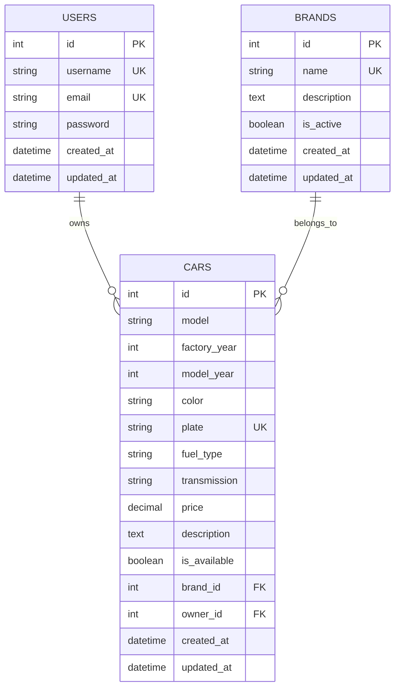
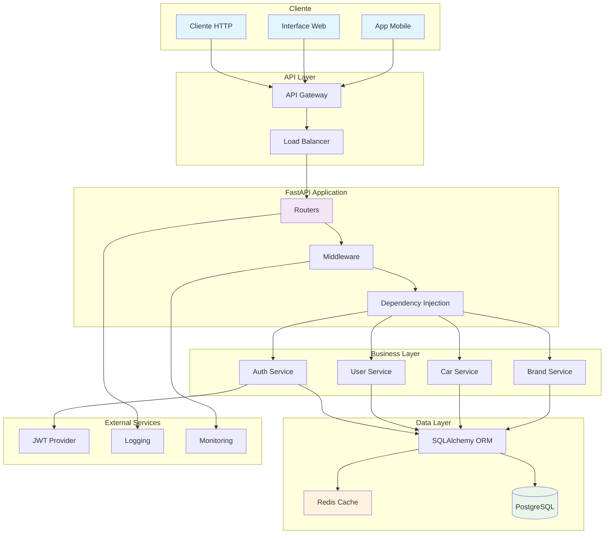
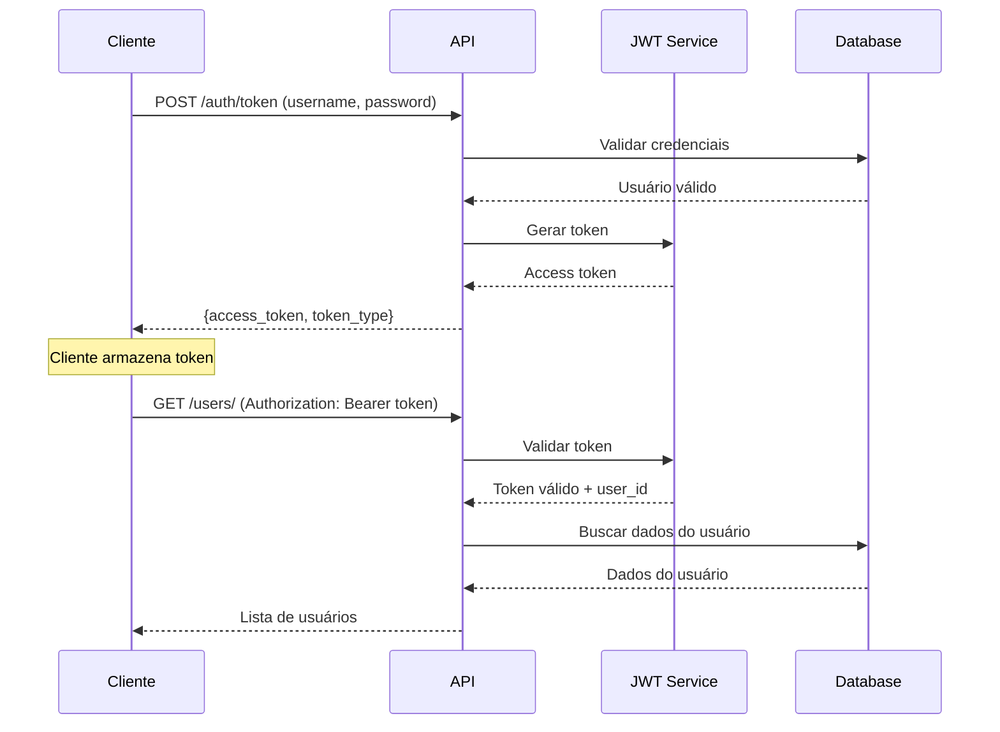
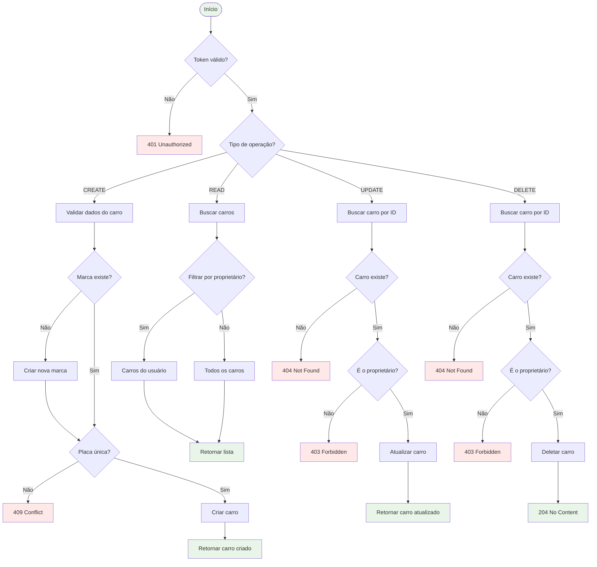
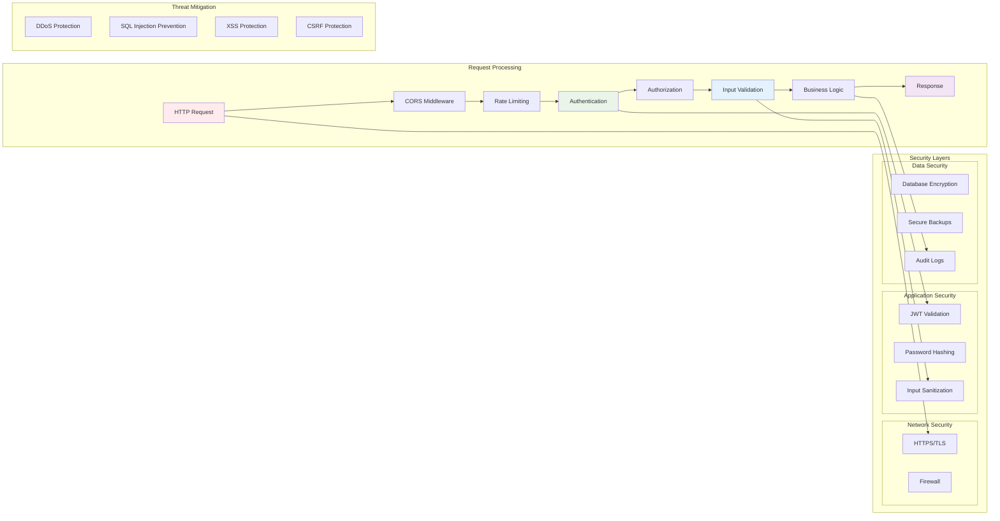
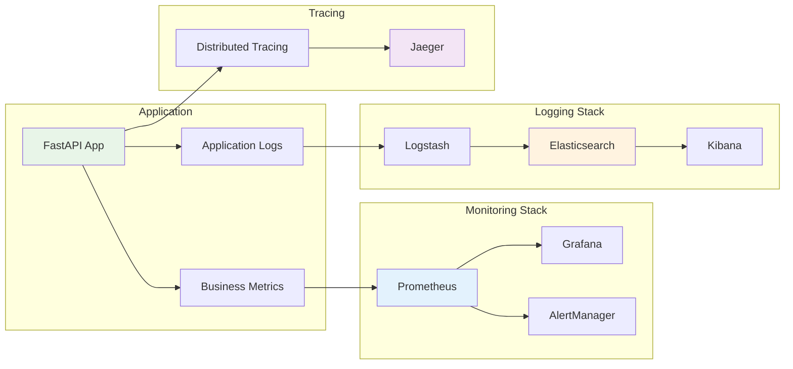
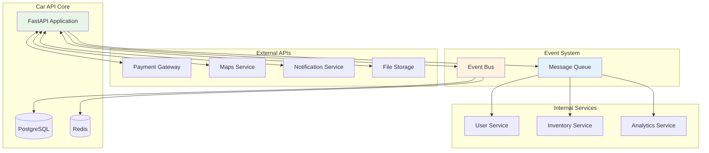
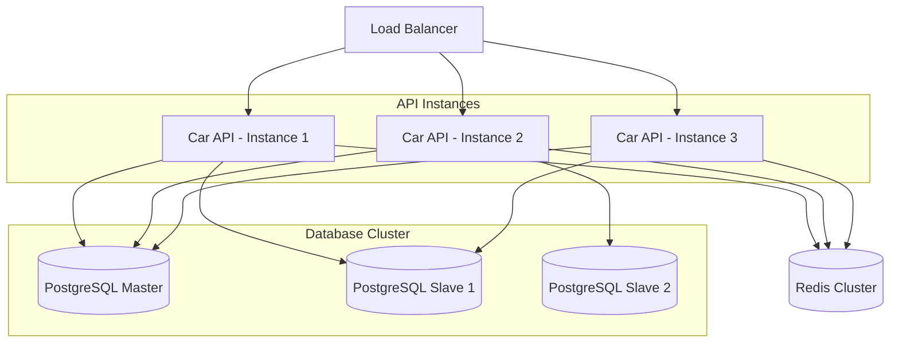

# Modelagem do Sistema

## 🏗️ Visão Geral Arquitetural

Este documento apresenta a modelagem completa do sistema Car API, incluindo diagramas de dados, arquitetura, fluxos de autenticação e operações CRUD.

## 📊 Modelo de Dados (ERD)

### Diagrama Entidade-Relacionamento



### Descrição das Entidades

#### 👤 USERS (Usuários)
- **Propósito**: Armazenar informações dos usuários do sistema
- **Características**:
  - Cada usuário pode ter múltiplos carros
  - Username e email são únicos
  - Senha armazenada com hash Argon2
  - Timestamps de auditoria

#### 🏷️ BRANDS (Marcas)
- **Propósito**: Catálogo de marcas de veículos
- **Características**:
  - Nome único no sistema
  - Controle de ativação/desativação
  - Descrição opcional
  - Uma marca pode ter múltiplos carros

#### 🚗 CARS (Carros)
- **Propósito**: Registro de veículos no sistema
- **Características**:
  - Placa única no sistema
  - Relacionamento com marca e proprietário
  - Informações técnicas detalhadas
  - Controle de disponibilidade
  - Preço com precisão decimal

### Relacionamentos

1. **USERS → CARS** (1:N)
   - Um usuário pode possuir múltiplos carros
   - Um carro pertence a apenas um usuário
   - Relacionamento obrigatório (owner_id NOT NULL)

2. **BRANDS → CARS** (1:N)
   - Uma marca pode ter múltiplos carros
   - Um carro pertence a apenas uma marca
   - Relacionamento obrigatório (brand_id NOT NULL)

### Constraints e Validações

```sql
-- Constraints de unicidade
UNIQUE(users.username)
UNIQUE(users.email)
UNIQUE(brands.name)
UNIQUE(cars.plate)

-- Constraints de integridade referencial
FOREIGN KEY(cars.owner_id) REFERENCES users(id)
FOREIGN KEY(cars.brand_id) REFERENCES brands(id)

-- Constraints de validação
CHECK(cars.factory_year >= 1900 AND cars.factory_year <= 2030)
CHECK(cars.model_year >= 1900 AND cars.model_year <= 2030)
CHECK(cars.price > 0)
CHECK(cars.fuel_type IN ('gasoline', 'ethanol', 'flex', 'diesel', 'electric', 'hybrid'))
CHECK(cars.transmission IN ('manual', 'automatic', 'semi_automatic', 'cvt'))
```

## 🏛️ Arquitetura do Sistema

### Diagrama de Arquitetura



### Camadas da Arquitetura

#### 1. **Cliente Layer**
- **Responsabilidade**: Interface com usuário
- **Componentes**: CLI, Web UI, Mobile App
- **Protocolos**: HTTP/HTTPS, REST

#### 2. **API Layer**
- **Responsabilidade**: Gerenciamento de tráfego
- **Componentes**: API Gateway, Load Balancer
- **Funcionalidades**: Rate limiting, CORS, SSL

#### 3. **Application Layer**
- **Responsabilidade**: Lógica de apresentação
- **Componentes**: FastAPI Routers, Middleware
- **Funcionalidades**: Roteamento, validação, serialização

#### 4. **Business Layer**
- **Responsabilidade**: Regras de negócio
- **Componentes**: Services (implícitos nos routers)
- **Funcionalidades**: Autenticação, CRUD, validações

#### 5. **Data Layer**
- **Responsabilidade**: Persistência de dados
- **Componentes**: SQLAlchemy ORM, PostgreSQL
- **Funcionalidades**: Transações, relacionamentos, cache

## 🔑 Fluxo de Autenticação

### Diagrama de Autenticação JWT



### Componentes de Segurança

#### 1. **Password Hashing**
```python
from pwdlib import PasswordHash

pwd_context = PasswordHash.recommended()

def get_password_hash(password: str) -> str:
    return pwd_context.hash(password)

def verify_password(plain_password: str, hashed_password: str) -> bool:
    return pwd_context.verify(plain_password, hashed_password)
```

#### 2. **JWT Token Management**
```python
import jwt
from datetime import datetime, timedelta

def create_access_token(data: dict) -> str:
    to_encode = data.copy()
    expire = datetime.utcnow() + timedelta(minutes=settings.jwt_expiration_minutes)
    to_encode.update({"exp": expire})

    return jwt.encode(to_encode, settings.jwt_secret_key, algorithm=settings.jwt_algorithm)
```

#### 3. **Authorization Middleware**
```python
async def get_current_user(token: str = Depends(oauth2_scheme)) -> User:
    try:
        payload = jwt.decode(token, settings.jwt_secret_key, algorithms=[settings.jwt_algorithm])
        user_id: str = payload.get("sub")
        if user_id is None:
            raise credentials_exception
    except JWTError:
        raise credentials_exception

    user = await get_user_by_id(user_id)
    if user is None:
        raise credentials_exception

    return user
```

## 🚗 Fluxo CRUD de Carros

### Diagrama de Operações CRUD



### Validações e Regras de Negócio

#### 1. **Validações de Criação**
```python
async def create_car(car: CarSchema, current_user: User, db: AsyncSession):
    # 1. Validar placa única
    plate_exists = await db.scalar(select(exists().where(Car.plate == car.plate)))
    if plate_exists:
        raise HTTPException(400, "Placa já está em uso")

    # 2. Validar marca existe
    brand_exists = await db.scalar(select(exists().where(Brand.id == car.brand_id)))
    if not brand_exists:
        raise HTTPException(400, "Marca não encontrada")

    # 3. Criar carro com proprietário
    db_car = Car(**car.dict(), owner_id=current_user.id)
```

#### 2. **Validações de Propriedade**
```python
def verify_car_ownership(current_user: User, car_owner_id: int):
    if current_user.id != car_owner_id:
        raise HTTPException(403, "Acesso negado")
```

#### 3. **Filtros de Busca**
```python
# Aplicar filtros dinamicamente
if search:
    query = query.where(
        (Car.model.ilike(f'%{search}%')) |
        (Car.plate.ilike(f'%{search}%'))
    )

if brand_id:
    query = query.where(Car.brand_id == brand_id)

if fuel_type:
    query = query.where(Car.fuel_type == fuel_type)

if min_price:
    query = query.where(Car.price >= min_price)
```

## 🛡️ Fluxo de Segurança

### Diagrama de Segurança Integrada



### Controles de Segurança Implementados

#### 1. **Autenticação Multi-Camada**
```python
# Layer 1: Token Validation
async def validate_token(token: str) -> dict:
    try:
        payload = jwt.decode(token, SECRET_KEY, algorithms=["HS256"])
        return payload
    except JWTError:
        raise HTTPException(401, "Token inválido")

# Layer 2: User Verification
async def get_current_user(payload: dict, db: AsyncSession) -> User:
    user = await db.get(User, payload["sub"])
    if not user:
        raise HTTPException(401, "Usuário não encontrado")
    return user

# Layer 3: Resource Authorization
def verify_resource_access(user: User, resource_owner_id: int):
    if user.id != resource_owner_id:
        raise HTTPException(403, "Acesso negado")
```

#### 2. **Validação de Entrada**
```python
# Schema Validation
class CarSchema(BaseModel):
    model: str = Field(..., min_length=1, max_length=100)
    factory_year: int = Field(..., ge=1900, le=2030)
    price: Decimal = Field(..., gt=0)
    plate: str = Field(..., regex=r'^[A-Z]{3}[0-9]{4}$|^[A-Z]{3}[0-9][A-Z][0-9]{2}$')

# SQL Injection Prevention (SQLAlchemy ORM)
query = select(Car).where(Car.plate == plate)  # Parameterized query
```

#### 3. **Rate Limiting e CORS**
```python
# CORS Configuration
app.add_middleware(
    CORSMiddleware,
    allow_origins=["https://yourdomain.com"],
    allow_credentials=True,
    allow_methods=["GET", "POST", "PUT", "DELETE"],
    allow_headers=["*"],
)

# Rate Limiting (Planned)
@limits(calls=100, period=60)  # 100 calls per minute
async def rate_limited_endpoint():
    pass
```

## 📊 Métricas e Monitoramento

### Diagrama de Observabilidade



### KPIs e Métricas

#### 1. **Métricas de Performance**
- Response time médio: < 200ms
- Throughput: requests/segundo
- Error rate: < 1%
- Uptime: > 99.9%

#### 2. **Métricas de Negócio**
- Usuários ativos
- Carros cadastrados
- Transações por hora
- Taxa de conversão

#### 3. **Métricas de Segurança**
- Tentativas de login falhadas
- Tokens expirados
- Acessos negados
- Anomalias de tráfego

## 🔄 Padrões de Integração

### Diagrama de Integrações



## 📈 Escalabilidade e Performance

### Estratégias de Escalabilidade

#### 1. **Horizontal Scaling**


#### 2. **Caching Strategy**
```python
# Multi-level caching
@cache.memoize(timeout=300)  # 5 minutes
async def get_popular_cars():
    return await db.execute(
        select(Car).where(Car.is_available == True).limit(10)
    )

# Database query optimization
query = select(Car).options(
    selectinload(Car.brand),  # Eager loading
    selectinload(Car.owner)
).where(Car.owner_id == user_id)
```

## 🎯 Próximos Passos

Para explorar mais detalhes:

1. 🔐 [Autenticação e Segurança](authentication.md) - Implementação detalhada
2. 💻 [Desenvolvimento](development.md) - Fluxo de desenvolvimento
3. 🧪 [Testes](testing.md) - Estratégias de teste
4. 🚀 [Deploy](deployment.md) - Processo de implantação